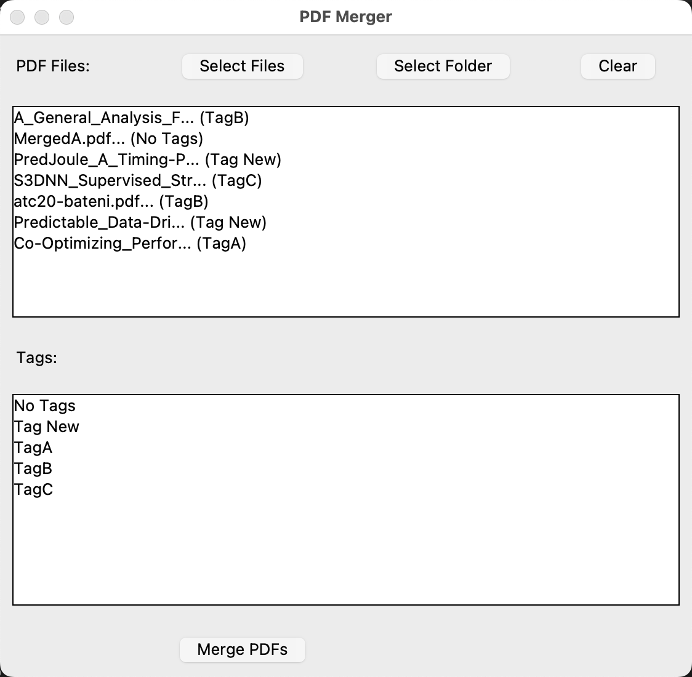
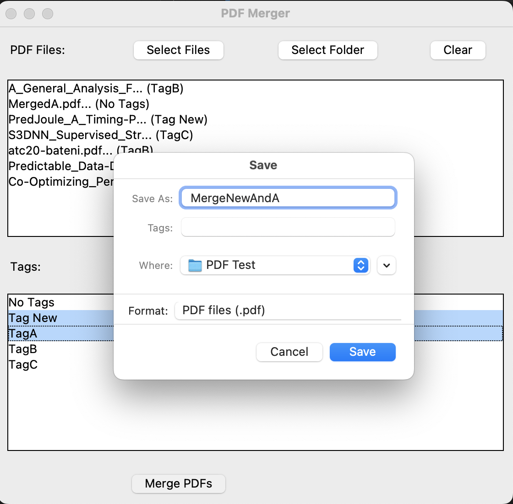
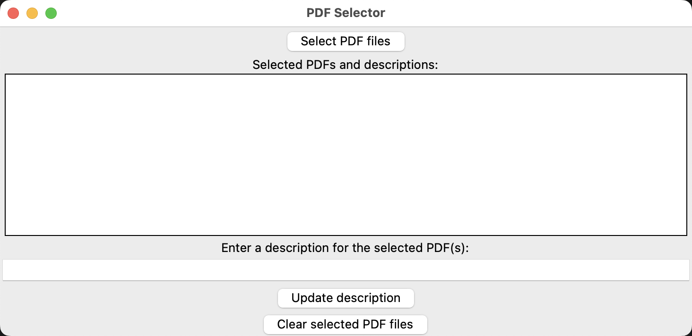
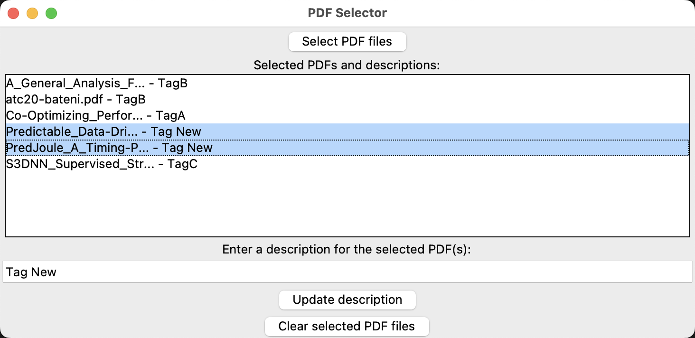

# PythonPDF Merger
> The whole software is generated by GPT-4
> 
> I only write this README.

An UI interface to select PDF files based on options and merging them to a single PDF file by python3

## Conversation with GPT-4
[Here](./ChatGPTConversation.md)

## Python Version Check
```shell
> python
Python 3.9.7 (default, Sep  3 2021, 12:37:55) 
[Clang 12.0.5 (clang-1205.0.22.9)] on darwin
Type "help", "copyright", "credits" or "license" for more information.
>>> 
```
Means your python version is `3.9.7`.

## Deps Installation
> Python3 Version: Python 3.9.7

```shell
pip install -r requirements.txt
```
or
If you can not make sure the python version of your global pip
```shell
python3 -m pip install -r requirement.txt
```

## Launch the merge Tool
> 1. Select pdf files or a folder full of pdf files
> 2. Select options from options list(You can change it in code) (Optional)
> 3. Automatically merge the PDF files matching options you selected. (No option selected: merge all files you selected)
```shell
python main.py
```

#### Merge PDF Files





## Launch the tag Tool
> Give descriptive tags to different pdf files
> This tool is for users to assign tags to PDF files so that you can merge the files with the same tag.
> Tags are not a must to merge files.

```shell
python tag.py
```

#### Add Tag to PDF files(Optional)




## Problem Solving

1. Make sure you are using python3.x
2. > ModuleNotFoundError: No module named '_tkinter'

    It's because when you install python3, you didn't choose with tk.
    See more about [how to install tk](https://stackoverflow.com/questions/5459444/tkinter-python-may-not-be-configured-for-tk)

    For Mac OS
    ```shell
    brew install python-tk
    ```

    For Ubuntu
    ```shell
    sudo apt-get install python-tk python3-tk tk-dev
    ```

    For Windows: Reinsall your python3 and make sure choose tk-tools(just check everything related to tk lib)
